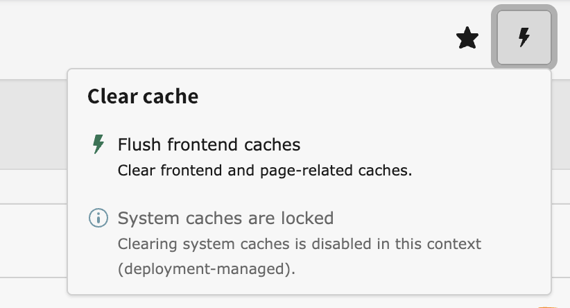

# Cache Guard

[](https://github.com/wazum/cache-guard/actions)
[](https://www.php.net/)
[](https://typo3.org/)
[](LICENSE)

Deployment warms your system caches; this extension makes sure no backend user wipes them between deployments. Editors keep clearing page caches, deployments keep flushing everything — only the destructive bulk flush of warmed system caches is locked in production.



## Installation

```bash
composer require wazum/cache-guard
```

No setup needed — the defaults lock the `system` cache group in `Production` contexts.

## What it does

- Blocks flushing of configured cache groups (default: `system`) in configured application contexts (default: `Production`, matched as prefix, so `Production/Staging` is included).
- Blocks the full opcache reset triggered by "Flush all caches"; targeted single-file opcache invalidation keeps working.
- Replaces the "Flush all caches" entry in the clear-cache toolbar with a disabled notice while the lock is active; the dropdown and "Flush frontend caches" stay in place.
- "Flush frontend caches" (pages) keeps working for editors.

## Flush a single cache (CLI)

Clear only specific caches without wiping a whole group — e.g. recompile Fluid templates after a deployment without touching the warmed PHP-code, l10n or DI caches:

```bash
vendor/bin/typo3 cache:flush --cache fluid_template
vendor/bin/typo3 cache:flush --cache fluid_template,l10n
```

All identifiers must be valid or nothing is flushed. The dependency injection cache is not flushable this way — use `cache:flush --group di`.

## What it does not block

- CLI: `vendor/bin/typo3 cache:flush` always works — deployments are unaffected.
- The Install Tool / Maintenance "Flush cache" and the DI container cache (system-maintainer territory).
- Tag-based invalidation (`flushCachesByTag`/`flushCachesByTags`) — targeted invalidation is not a bulk clear.

## Configuration

Admin Tools → Settings → Extension Configuration → cache_guard:

| Option | Default | Description |
| --- | --- | --- |
| `lockedGroups` | `system` | Comma-separated cache groups that must not be flushed from the backend |
| `lockedContexts` | `Production` | Comma-separated application context prefixes in which the lock is active |

## Defense in depth (optional)

Hide the "Flush all caches" entry per user/group via User TSconfig (UI only, the lock above is the actual enforcement):

```
options.clearCache.all = 0
```

## Requirements

- TYPO3 13.4 or 14.3
- PHP 8.2, 8.3, 8.4 or 8.5

## License

GPL-2.0-or-later — see [LICENSE](LICENSE).
